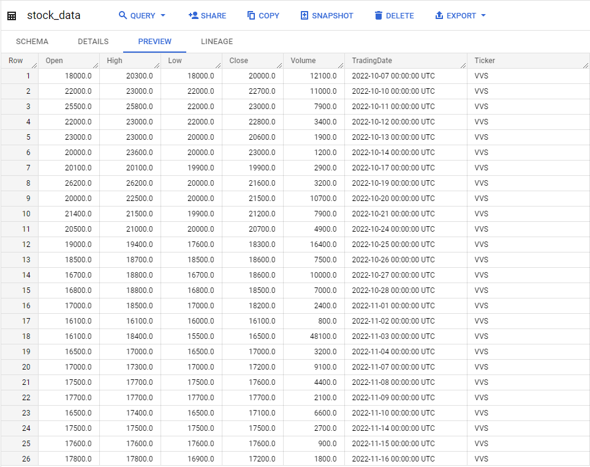
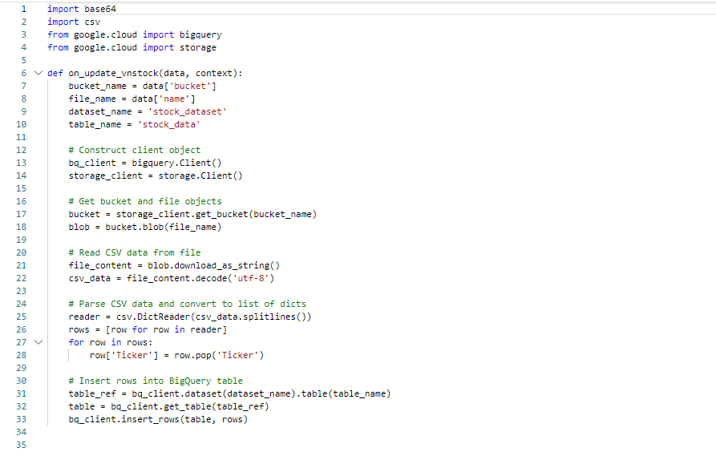

# [Python + Google Cloud Platform] Vietnam stock market data

## Introduction

Bài toán: Get data on Vietnam's stock market to base on data to make decisions in buying and selling stocks.

**Yêu cầu**: 

1. Snapshot of all stock data from 01/02/2010 to the current time and save in Google Cloud Storage and write to Bigquery.
2. Automating the daily data pipeline will be updated every 4pm and saved to GCS & Imported into Bigquery.

## Demo

   
  <i>Example data in BigQuery</i>

   
  <i>Cloud Storage Function update data to Bigquery automatic</i>

